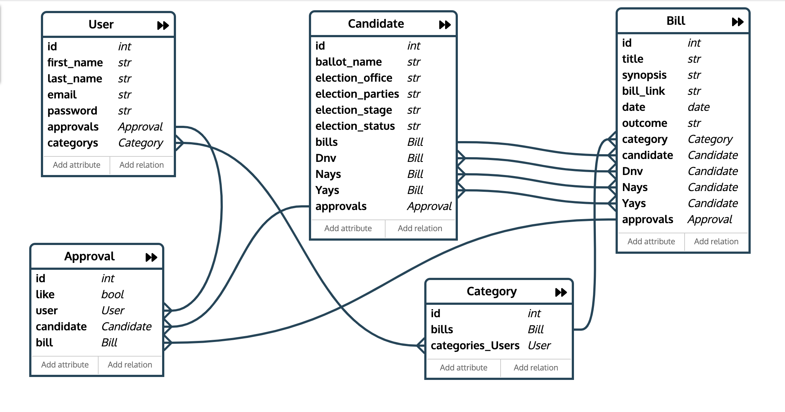

# Final Project

## Wireframes

## ERD

## Deployment

If your project uses the `react_on_rails` gem, you will need to:

* `heroku create your-app-name`
* `heroku buildpacks:set --index 1 heroku/nodejs`
* `heroku buildpacks:add heroku/ruby`
* `git push heroku master`
* `heroku run rails db:migrate`
* optional: `heroku run rails db:seed`

## Instructor Checklist

* Clone this repo, create a new one
* Set branch protection rules on `master` (There is a CODEOWNERS file in this repo, but it is up to you how you want to use it.)
* Create a Slack Channel, invite team members and TAs
* in Slack: `/github subscribe wyncode/repo_name issues,reviews,comments`
# Votelity_Webapp
# Votelity_Webapp
